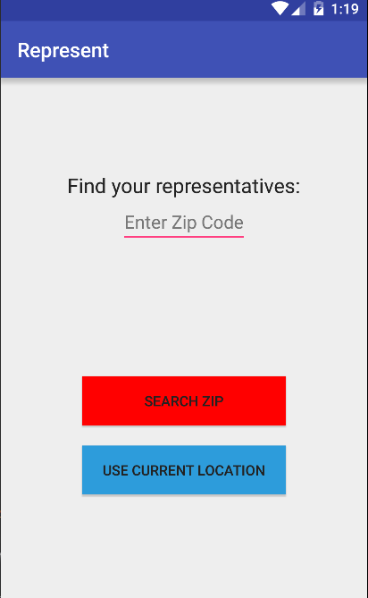
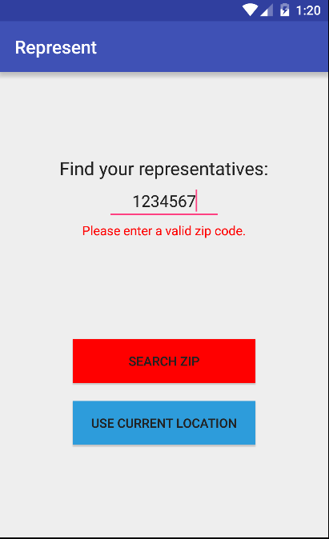
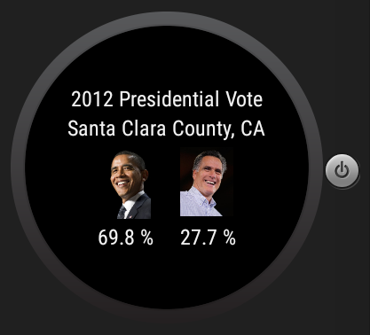

# PROG 02: Represent!

Represent Basic Functionality

## Authors

Vincent Wang ([vincent_wang@berkeley.edu](mailto:vincent_wang@berkeley.edu))

## Mobile Screenshots

## Wear Screenshots

## Demo Video

Part B:
See [Part B Video] (https://www.youtube.com/watch?v=Bm-AeyueWis)
Please read description!

Part C:
See [Part C Video] (https://www.youtube.com/watch?v=zWNxpU16OM8)

## Acknowledgments

Me, myself, stackoverflow
