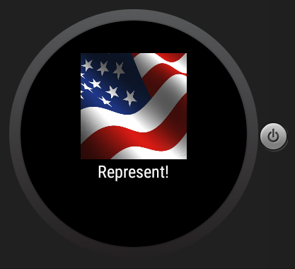

# PROG 02: Represent!

This app allows the user to look up the representatives (Congressmen and Senators) at
either the user's location, a specified zip code, or a random location in the US.

### Mobile:
There are 3 views: the home screen, the congressional view, and the detailed view.

The home screen allows the user to input a zip code to search, or choose to search
at the current location.

The congressional view displays a list of representatives at the location, with
the representative's name, party picture, email, website, and latest twitter post.

The detailed view displays a single representative's basic information as well as the
committees the representative is part of, and a list of bills the representative has
recently sponsored.

### Wear

There are 2 views the main view and vote view.

Main view: updated with representatives after a search is made from the mobile app.
The user can swipe to scroll through representatives.

Vote view: swiping past the last representative opens up the vote view, which displays
the name of the county searched at as well as 2012 voting results for that county.

Shake: Shaking the watch will perform a search at a random location in the US, updating
the mobile and wear displays accordingly.

## Authors

Vincent Wang ([vincent_wang@berkeley.edu](mailto:vincent_wang@berkeley.edu))

## Mobile Screenshots

## Wear Screenshots

## Demo Video

Part B:
See [Part B Video] (https://www.youtube.com/watch?v=Bm-AeyueWis)
Please read description!

Part C:
See [Part C Video] (https://www.youtube.com/watch?v=zWNxpU16OM8)

## Acknowledgments

Me, myself, stackoverflow
